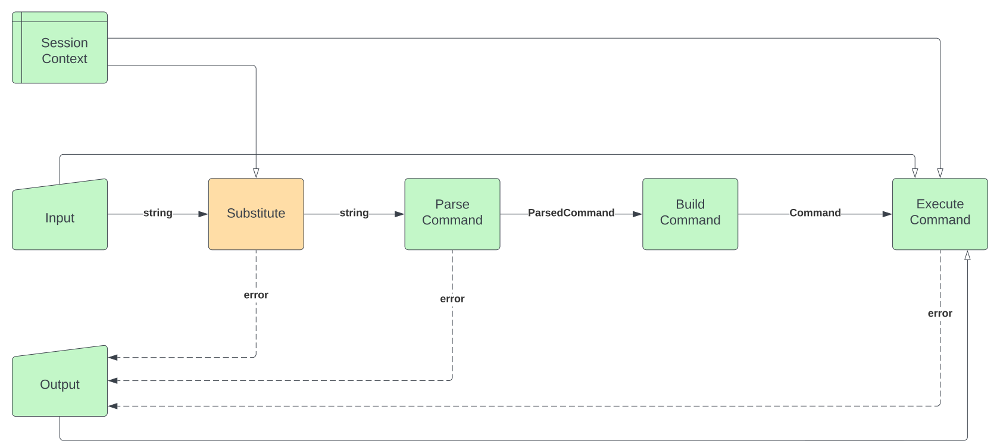
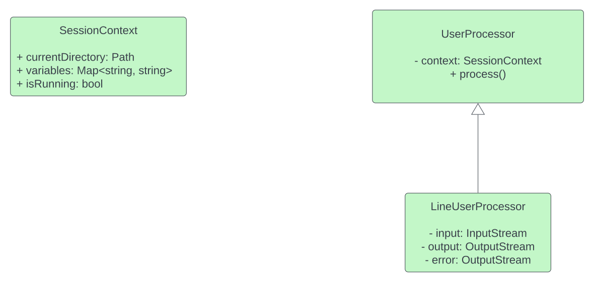

# Bash design

>*NB: фаза 1 разработки обозначена зеленым цветом, фаза 2 разработки обозначена оранжевым цветом.*

## Pipeline

Контролем пайплайна занимаются наследники класса `UserProcessor`.

1. При запуске программы:

* Создается контекст окружения (`SessionContext`), содержащий информацию о переменных и текущей директории
* Определяются потоки ввода и вывода пользователя
* Определяются доступные команды

2. При очередном вводе строки (поддержка только однострочного ввода) выполняются следующий шаги:

* Выполняется подстановка (**Substitute**).
Вход: строка, Выход: строка с подставленными переменными
* Выполняется парсинг команд (**Parse Command**).
Вход: строка, Выход: Структура команд (`ParsedCommand`)
* Из распаршенных команд создаются классы команд (**Build Command**).
Вход: `ParsedCommand`, Выход: `Command`
* Далее идет запуск команды (**Execute Command**).
Вход: `Command`

3. Условие остановки программы: в `SessionContext` флаг `isRunning` выставлен в `false`.

### Substitute

Состоит из 2-х компонент:

1. Лексер (`SubstituteLexer`): разбивает строку на токены

* Специальные символы: `$,{,},’,”`
* `s` – последовательность любых подряд идущих символов
* `w` – последовательность подряд идущих английских букв
* `q – s`, подлежащее дальнейшему разбиению
* Правила формирования токена:
    * Токены цитаты: `‘s’`, `“q”`
    * Токены подстановки: `$w`, `${w}`, `${w:-q}`
    * Остальные токены – `s`, не попавшие в предыдущие токены

2. Парсер (`SubstituteParser`): интерпретирует токены и заменяет токены подстановки на значение переменных

* Токены подстановки заменяются на соответствующие значения переменных
* На выходе токены склеиваются в строку

### Parse Command

Состоит из 2-х компонент:

1. Лексер (`CommandLexer`): разбивает строку на токены

* Специальные символы: `‘,”,|,=,;,{,}`
* `s` – последовательность любых подряд идущих символов
* `n` – последовательность подряд идущих символов за исключением специальных символов и пробелов
* `w` – последовательность подряд идущих английских букв
* `q – s`, подлежащее дальнейшему разбиению
* Правила формирования токена:
    * Токены цитаты: `“s”`, `‘s’`
    * Токены комбинирования: `{ q; }`
    * Токены разделители: `;`
    * Токены пайпы: `|`
    * Токены присваивания: `w=n`, `w=”s”`, `w=’s’`
    * Остальные токены – `n`, не попавшие в предыдущие токены

2. Парсер (`CommandParser`): интерпретирует токены и строит структуру команд

* Строит структуру команд `ParsedCommand` (используется паттерн *Composite*), разбивая на группы токенов, которые относятся к командам: команда + аргумент, присваивание

### Build Command

Основной компонент - фабрика команд `CommandFactory`. Фабрика создает экземпляры команд.

Внутреннее устройство `CommandFactory`:

* Ассоциативный массив `commandConstructors`
    * Хранит пары <имя команды> - <конструктор класса команды>
    * Заполняется при инициализации фабрики проходом по всем наследникам базового класса `Command`
    * При ошибке заполнения (несколько команд с одинаковым названием, …) инициализация фабрики бросает исключение
* Публичный метод `getCommand`
    * По строковому названию команды возвращает экземпляр класса команды
    * Обращается к `commandConstructors` для получения конструктора
    * Если названия команды нет в `commandConstructors`, возвращает экземпляр класса неизвестной команды (`UnknownCommand`)

### Execute Command

Выполнение команд происходит с помощью паттерна *Visitor* с интерфейсом `CommandBuildVisitor`.

Вызывается метод `execute` у пришедшей команды, передавая `output, input, session context`.
Важное замечание: внутри `Pipe` контекст передается по значению.

## Диаграммы

