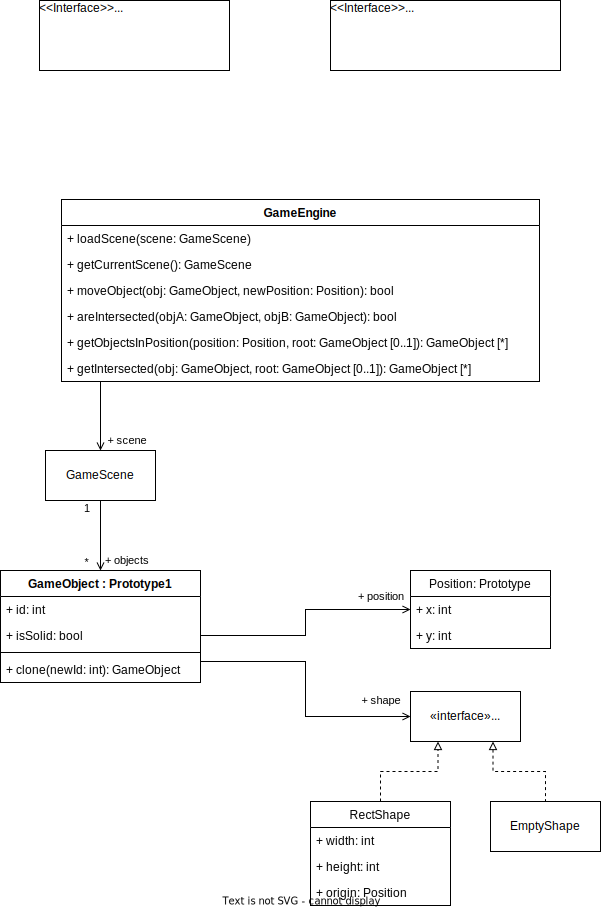
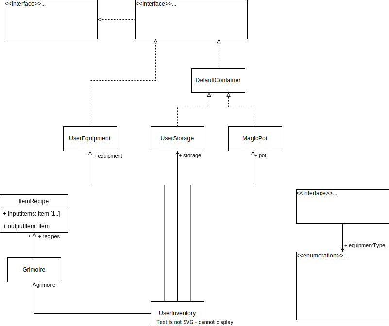

# Архитектурное описание Roguelike

## Общие сведения

*"Alchemist"* - консольная Rougelike игра, в которой основной целью игрока является создание философского камня.
У игрока всегда с собой есть гримуар с “рецептами” объектов, который можно и нужно пополнять, и волшебный котел, куда он
может скинуть нужные ингредиенты и получить нужный ему объект из гримуара.

Игровой мир преставляет собой большую башню с множеством этажей. На каждом этаже разбросаны сундуки с предметами и
рецептами, и, конечно же, есть монстры.

Добывать ингредиенты можно несколькими способами:

- Создавать с помощью волшебного котла
- Находить в башне (в сундуках)
- Добывать из убитых монстров

## Architectural drivers

Ограничения/требования:

- Работа с котлом:
    - Рецепты уникальны
    - Пользователь передает ингредиенты из инвентаря
    - На выходе объект соответствующий переданному набору ингредиентов
    - Котел обрабатывает только те рецепты, которые есть в гримуаре
- Работа с гримуаром:
    - Пользователь может читать доступные ему рецепты
    - Найденные рецепты автоматически добавляются в гримуар
- Характеристики игрока:
    - Здоровье
    - Атака
    - Защита
- Инвентарь:
    - Экипировка: оружие, одежда
    - Гримуар
    - Волшебный котел
    - Остальные предметы
    - Нет ограничений
- Поле:
    - Ограниченное кол-во уровней
    - Каждый уровень генерируется случайно при создании игры и ограничен по размерам
    - На каждом уровне есть определенный стиль:
        - Ограниченный набор предметов и рецептов, которые возможно получить на этом уровне
        - Предметы, которые всегда можно получить на этом уровне
        - Ограниченный набор монстров
    - На каждом уровне есть лестницы вверх и вниз, кроме крайних
- Характеристики монстров:
    - Здоровье
    - Броня
    - Урон
    - Возможные предметы, которые выпадают игроку после убийства
    - Предметы, которые точно выпадают игроку после убийства
- Взаимодействие с монстрами:
    - Атака игрока
    - Атака монстра
    - Собрать предметы, при смерти
- Отображение (UI):
    - Консоль

## User story

1. Начать игру:
    - Генерация уровней
    - Инициализация объектов, модулей
    - Запуск и отображение игры
2. Открыть инвентарь *(необходимо 1)*:
    - Поставить на паузу процессы на игровом поле
    - Отобразить окно хранилища
    - Отобразить окно экипировки
    - Отобразить окно волшебного котла
3. Навигация в инвентаре *(необходимо 2)*:
    - Определить нажатую клавишу
    - Сделать неактивным текущий предмет в инвентаре
    - Изменить текущий объект в инвентаре, в соответствии с нажатой клавишей
    - Сделать активным новый текущий предмет в инвентаре
4. Надеть предмет *(необходимо 2 и активный предмет в хранилище)*:
    - Определить категорию выбранного предмета (оружие, шлем и т.п.)
    - Переместить уже надетый предмет данной категории, если он есть, в хранилище
    - Отменить его свойства, примененные к характеристикам игрока
    - Переместить выбранный предмет в экипировку
    - Применить его свойства к характеристикам игрока
5. Снять предмет *(необходимо 2 и активный предмет в экипировке)*:
    - Переместить выбранный предмет в хранилище
    - Отменить его свойства, примененные к характеристикам игрока
6. Открыть гримуар *(необходимо 1)*:
    - Поставить на паузу процессы на игровом поле
    - Отобразить гримуар
7. Положить предмет в волшебный котел *(необходимо 2 и активный предмет в хранилище)*:
    - Уменьшить кол-во выбранного предмета на 1 в хранилище
    - Увеличить кол-во выбранного предмета на 1 в котле
8. Убрать предмет из котла *(необходимо 2 и активный предмет в котле)*:
    - Уменьшить кол-во выбранного предмета на 1 в котле
    - Увеличить кол-во выбранного предмета на 1 в хранилище
9. Создать новый предмет в котле *(необходимо 2)*:
    - Найти подходящий рецепт из гримуара
    - Если такой есть:
        - Удалить все предметы из котла
        - Создать конечный предмет и положить в хранилище
    - Если такого нет:
        - Вывести сообщение об этом
10. Переместить игрока *(необходимо 1)*:
    - Определить нажатую клавишу
    - Поменять направление игрока, в соответствии с нажатой клавишей
    - Переместить игрока в выбранном направлении, если это возможно
11. Атаковать *(необходимо 1)*:
    - Определить нажатую клавишу
    - Определить направление и расстояние атаки
    - Изменить уровень жизни объектам находящимся на пути атаки в пределах расстояния атаки, в соответствии с
      характеристиками объекта и атакующего
12. Взаимодействовать с объектом на поле *(необходимо 1)*:
    - Определить объект перед игроком
    - Сделать действие (зависит от объекта)
13. Поднять предметы *(необходимо 12)*:
    - Поставить на паузу
    - Добавить предметы в хранилище
    - Убрать предметы с поля
    - Отобразить поднятые предметы

## Композиция

| Компонент               | Описание                                                                                                                                                                                                                                                                                            |
|-------------------------|:----------------------------------------------------------------------------------------------------------------------------------------------------------------------------------------------------------------------------------------------------------------------------------------------------|
| **GameLauncher**        | Точка входа в игру. Отвечает за инициализацию движка, элементов взаимодействия с пользователем, игры и ее компонентов, а также за цикл игрового процесса.                                                                                                                                           |
| **MapGenerator**        | Генератор поля. Отвечает за создание карты и генерацию ее уровней, включая расположение стен, лестниц, позиции и типы предметов и монстров. Для каждого запуска игры поле генерируется случайно, но в то же время согласованно с установленными правилами, гарантируя возможность прохождения игры. |
| **Engine**              | Игровой движок. Отвечает за расположение объектов, обнаружение их пересечений и т.д.                                                                                                                                                                                                                |
| **UI**                  | Пользовательский интерфейс. Отвечает за визуализацию игрового поля, характеристик игрока, окна инвентаря и т.д.                                                                                                                                                                                     |
| **UserEventController** | Система, оповещающая своих подписчиков (в том числе UI и игровые объекты) о действиях пользователя.                                                                                                                                                                                                 |
| **EntityComponent**     | Компонент контроля объектов с представлением на карте (например, игрок, монстры, лестница и т.д.). Реализует такую игровую логику, как перемещение, атака, взаимодействие.                                                                                                                          | 
| **InventoryComponent**  | Компонент контроля объектов с представлением в инвентаре (например, оружие, рецепт, материалы и т.д.). Реализует такую игровую логику, как смена экипировки и создание новых объектов.                                                                                                              |

## Логическая структура

### Engine

Игровые объекты представлены в виде их положения и формы. Также объекты представляют древовидную структуру, 
и, соответственно, предоставлен способ обойти эту структуру с помощью паттерна визитор.  

Также сам движок предоставляет некоторую функциональность:
- Передвижение объекта на сцене, с проверкой столкновения с другими объектами.
- Проверка на пересечение объектов и их нахождение

### UserEventController

Предоставляет способ отслеживать внешние события (паттерн слушателя). Также инкапсулирован способ создания событий для возможности подмены или различных способов доставки этих событий.

### InventoryComponent

Предоставлен интерфейс с хранением и внутренней навигацией по предметам.
Инстансы:
- UserStorage - хранилище предметов игрока
- UserEquipment - экипировка игрока
- MagicPot - волшебный котел
- DefaultContainer - контейнер для предметов в сундуках, монстрах и т.п.

Также есть класс гримуара с рецептами предметов.

### EntityComponent

Есть глобальный контроллер состояния игры, содержащий текущий уровень, всю карту с уровнями, пользователя и состояние игры.

Также имеется обертка над физическими объектами на карте - `Entity`, которая реализует логику взаимодействия между этими объектами.

Методы `tick()` являются триггером для обновления состояния объектов и игры в целом.

#### Bash
У перемещаемых объектов `MovableEntity` есть необходимость взаимодействовать с объектами на их пути, соответственно, для этого сделан класс `InteractionStrategy`.

На базе этого реализована возможность конфузить мобов: `BashInteractionDecorator` - класс, который при взаимодействии с монстром пытается его оглушить.

#### Поведение монстров
Поведение монстров полностью реализовано классами-наследниками `MonsterStrategy`.

### MapGenerator

Генерация карты происходит по уровням, для каждого уровня генерируется сцена для движка и остальная информация, которая полностью описывает объекты.

### UI

Для каждого элемента, который может быть отображен в консоли, есть свой класс. Затем есть класс, который отрисовывает текущий уровень, и класс для отрисовки всей игры в целом вместе с интерфейсами для игрока.

Также есть классы, отвечающие за навигацию.

### GameLauncher

Инициализирует все компоненты, необходимые для работы игры, генерирует карту и запускает саму игру, вызывая в цикле метод `tick()`, а затем отрисовывает сцену заново.

Основной пайплайн:

Взаимодействие с пользователем:

